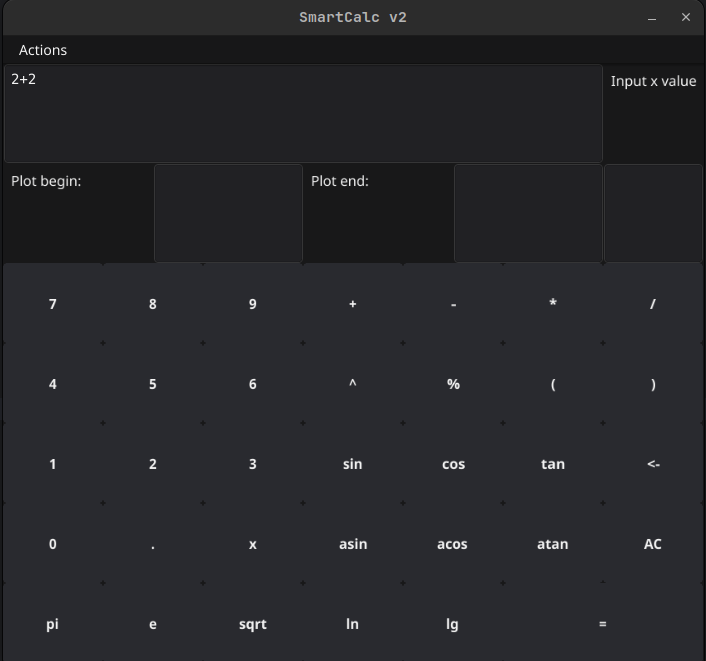
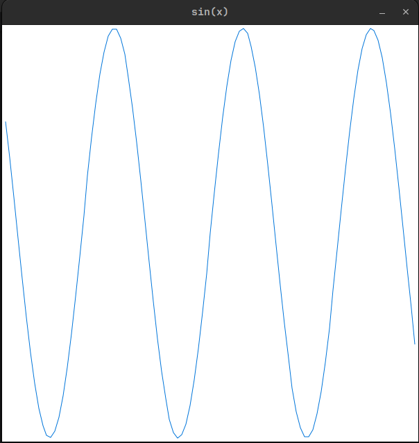

# SmartCalculation-v2.0

Calculator implementation with GUI on Golang and core on C++

# Content

This project implements a calculator with the following features:
1. Plotting functions
2. Calculating the value of a function at a point
3. Direct calculation
4. Saving the history of expressions and using it
5. Logging and saving log files

The GUI is written in Go using [fyne](https://fyne.io/).
The kernel is written in C++ with a C interface to call kernel functions from Go.
The kernel is assembled as a dynamic library with subsequent linking.
The core logic for the kernel has already been implemented in the previous version of the calculator,
in this version, it has only changed.

[Core](https://github.com/sav1nbrave4code/Smart-Calculation-v1.0)

Minimal attention is paid to the external plan of the project, the main goal is to study
Connect several programming services in different languages.

Ways to save logs, save expression history, GUI appearance -
configured via `config.json` file

To run the project `cd src && make`

