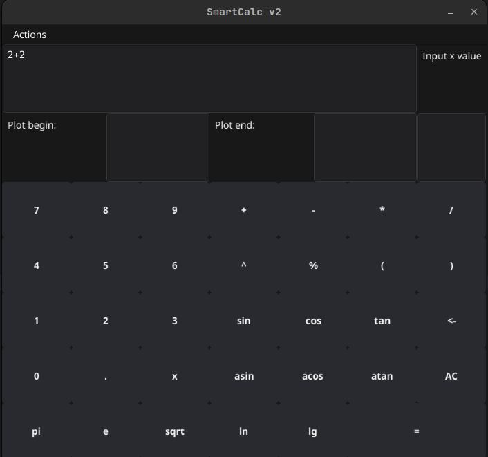

# SmartCalculation-v.2-0

Calculator implementation with GUI on Golang and core on C++

# Содержание

В данном проекте реализован калькулятор со следующими возможностями:
1. Построение графиков функций
2. Вычисление значения функции в точке
3. Прямое вычисление 
4. Сохранение истории выражений и использование ее
5. Логирование и сохранение лог файлов

GUI написано на Go с использованием [fyne](https://fyne.io/).  
Ядро написано на C++ с интерфейсом на C, для вызова из Go функций ядра.
Ядро собирается в виде динамической библиотеки с последующей линковкой.
Основная логика для ядра уже была реализована в предыдущей версии калькулятора,
в данной версии она лишь претерпела изменения. 

[Core](https://github.com/sav1nbrave4code/Smart-Calculation-v1.0)

Внешнему виду проекта уделено минимальное внимание, основная цель - научиться
связывать между собой несколько сервисов на разных языках программирования.

Пути для сохранения логов, сохранения истории выражений, внешнего вида GUI -
конфигурируются через файл `config.json`

Для запуска проекта `cd src && make`

